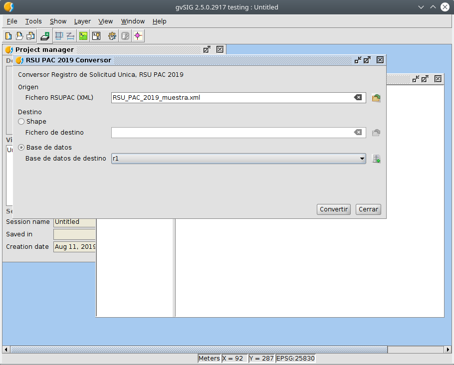

Coversor de ficheros RSU PAC 2019
====================================

Esta utilidad permite convertir uno a varios ficheros XML procedentes de RSU PAC 2019 a shape o cargarlos en una BBDD de datos personal (H2).

Cuando se convierten a formato shape, solo se carga en el shape parte de la informacion alfanumerica.  Si se hace a una BBDD se almacena en esta en una serie de tablas que contendran toda la informacion que hay en los XMLs de entrada.

Si se indica como fichero de entrada un fichero xml que su nombre termina en "_001.XML", automaticamente se buscaran junto a el los ficheros "_002.XML", "_003.XML"... y se pocesaran todos ellos.

